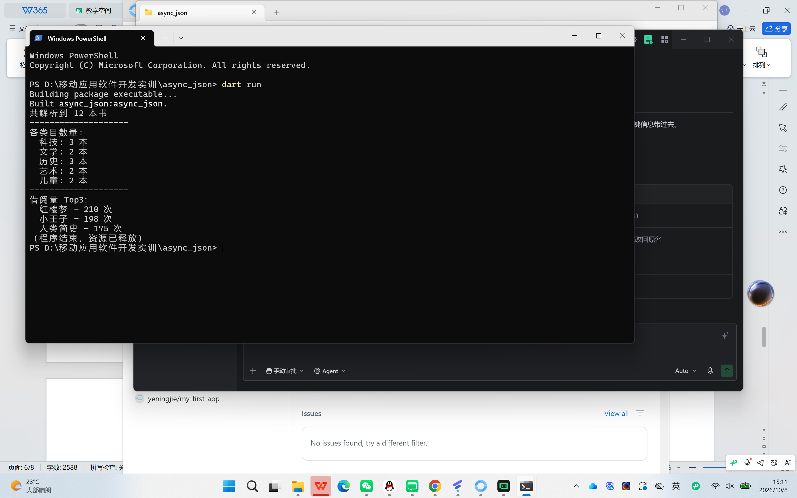
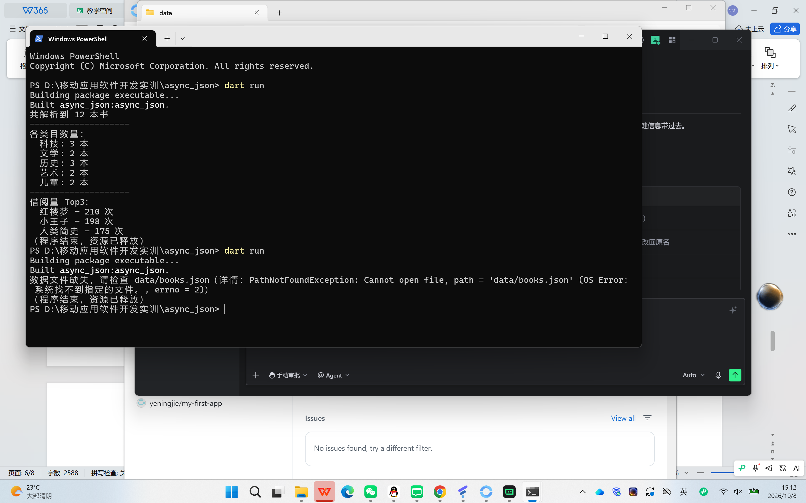
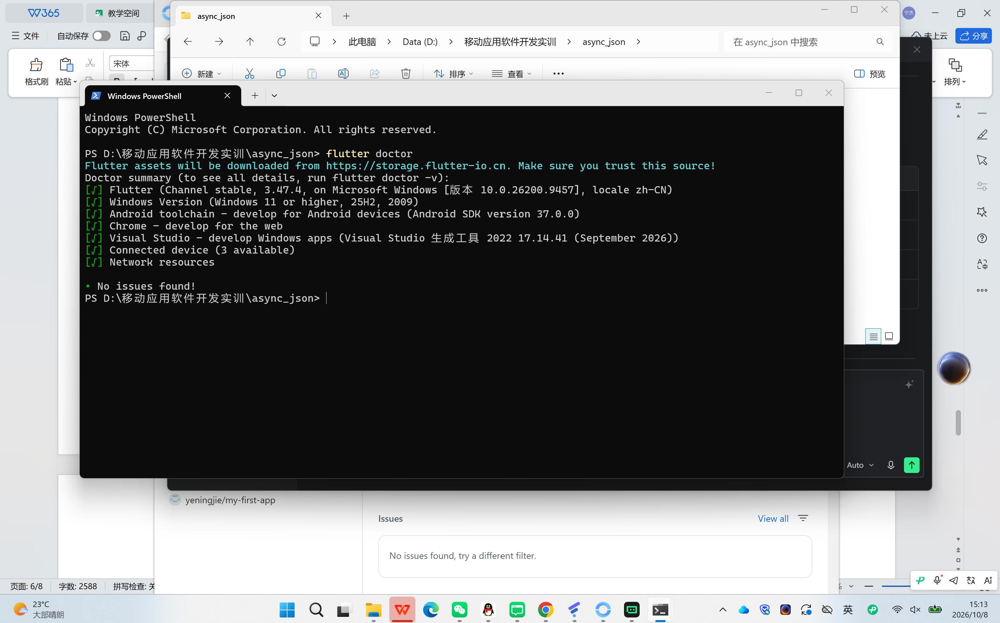
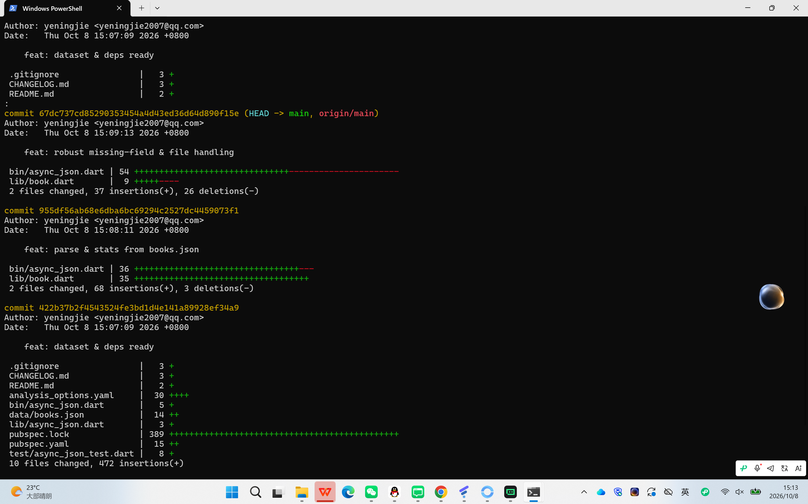

# 进度报告4（第6周·Dart语言基础三：异步、异常与包管理）

## 一、任务理解

本次作业要在本地创建一个名为 async_json 的纯 Dart 命令行工程：异步读取 data/books.json 数据文件，将其解析为 List<Book>，并输出统计信息——图书总数、各类目数量、借阅量 Top3。同时要求实现健壮的异常处理：文件缺失时给出友好提示且不崩溃，字段缺失时使用默认值。

验收标准：正常路径统计正确、异常路径友好提示不崩溃；代码推送至 GitHub lecture4 仓库且不少于3次提交；附 dart run（正常/异常）、flutter doctor、git log --stat 共4张截图。

## 二、环境与工具

- 开发环境：Windows 11 + Dart SDK 3.13.3 (stable) + Flutter 3.47.4 (stable, Channel stable) + Git 2.55.0
- 运行目标：命令行（纯 Dart 控制台应用，非 Flutter UI）
- 版本控制：本地 `git init`，远程仓库 GitHub lecture4，分支 `main`
- AI 工具：TraeCode（GLM-5.2 模型）辅助生成代码框架与排查问题，所有输出均由本人逐行阅读并运行 `dart run` 验证后才提交

## 三、过程记录

1. 在 GitHub 创建名为 lecture4 的空仓库。
2. 在 `d:\移动应用软件开发实训` 下执行 `dart create async_json` 创建工程。
3. 在工程目录执行 `dart pub add path` 添加 path 依赖。
4. 创建 `data/books.json`，写入12本图书，覆盖科技/文学/历史/艺术/儿童5个类目。
5. `git init` 并首次提交 `feat: dataset & deps ready`。
6. 新建 `lib/book.dart`（Book 类 + fromJson/toJson），改写 `bin/async_json.dart` 实现异步读取 + fold 统计类目 + sort 取 Top3。
7. `dart run` 验证输出正确，第二次提交 `feat: parse & stats from books.json`。
8. 增强 fromJson 字段缺失默认值；main 加入 `try / on FileSystemException / catch / finally` 异常处理。
9. 将 `data/books.json` 改名为 `books.json.bak` 测试异常路径，输出"数据文件缺失"且不崩溃，测试后改回原名。第三次提交 `feat: robust missing-field & file handling`。
10. `git remote add origin` + `git branch -M main` + `git push -u origin main` 推送到 GitHub。
11. 分别运行 dart run（正常/异常）、flutter doctor、git log --stat 并全屏截图4张，存入 `docs/` 目录。

## 四、关键代码

### 片段1：Book.fromJson（lib/book.dart，AI 生成、本人核对）

```dart
factory Book.fromJson(Map<String, dynamic> json) {
  return Book(
    id: (json['id'] ?? '') as String,
    title: (json['title'] ?? '未知书名') as String,
    category: (json['category'] ?? '未分类') as String,
    borrowCount: (json['borrowCount'] ?? 0) as int,
  );
}
```

逐行说明：factory 构造函数接收 Map；对每个字段用 `??` 提供默认值，确保字段缺失时不抛异常；`as` 做类型断言。验证方式：构造缺失字段的 JSON 跑 dart run，确认走默认值不报错。

### 片段2：异步读取 + fold 统计（bin/async_json.dart，AI 生成、本人核对）

```dart
final content = await file.readAsString();
final raw = jsonDecode(content) as List<dynamic>;
final books = raw.map((e) => Book.fromJson(e as Map<String, dynamic>)).toList();
final categoryCount = books.fold<Map<String, int>>(<String, int>{}, (acc, b) {
  acc[b.category] = (acc[b.category] ?? 0) + 1;
  return acc;
});
```

逐行说明：`await` 异步读文件；`jsonDecode` 把字符串解析成动态列表；`map + toList` 转成 List<Book>；`fold` 以空 Map 为初值，逐本累加类目计数。验证：手算 12 本 = 科技3+文学2+历史3+艺术2+儿童2，与输出一致。

### 片段3：异常处理（bin/async_json.dart）

```dart
try { /* 主逻辑 */ }
on FileSystemException catch (e) {
  print('数据文件缺失，请检查 data/books.json（详情：$e）');
}
catch (e) { print('解析失败：$e'); }
finally { print('（程序结束，资源已释放）'); }
```

逐行说明：`on FileSystemException` 精准捕获文件缺失并友好提示；`catch` 兜底其他异常；`finally` 无论成败都执行。验证：改名 books.json 后跑 dart run，看到友好提示且不崩溃。

## 五、检查点结果

- **正常路径**：dart run 输出"共解析到 12 本书"，5个类目数量为 科技3/文学2/历史3/艺术2/儿童2（合计12），借阅量 Top3 为 红楼梦210次、小王子198次、人类简史175次，与 `data/books.json` 数据逐项核对一致。
- **异常路径**：将 `data/books.json` 改名为 `books.json.bak` 后再跑 dart run，输出"数据文件缺失，请检查 data/books.json（详情：PathNotFoundException: Cannot open file... errno = 2）"，程序未崩溃，finally 块打印"（程序结束，资源已释放）"。改回文件名后正常路径恢复。
- 两项检查点均通过。证据见 `docs/1-dart-run-normal.png` 与 `docs/2-dart-run-exception.png`。

## 六、问题与调试

- **问题**：初版直接 `await file.readAsString()`，文件缺失时会抛出未捕获的 `PathNotFoundException`，导致程序崩溃、退出码非0。
- **定位**：查阅 Dart SDK 文档，确认 `PathNotFoundException` 继承自 `FileSystemException`，可用 `on FileSystemException` 精准捕获。
- **解决**：用 `try { } on FileSystemException catch(e) { 友好提示 } catch(e) { 兜底 } finally { 释放提示 }` 包裹主逻辑。改名 books.json 后再次 dart run，程序输出友好提示且不崩溃，问题解决。
- **另一处**：fromJson 初版用 `json['borrowCount'] as int`，若字段缺失会因 `null as int` 报错；改为 `(json['borrowCount'] ?? 0) as int` 后字段缺失默认0，更健壮。

## 七、AI使用记录

- **用途1**：生成 Book 类与 main 异步读取/统计代码框架。指令摘要："实现 Book.fromJson + toJson、异步读取 data/books.json、fold 统计类目数量、sort 取借阅量 Top3"。输出：`lib/book.dart` 与 `bin/async_json.dart` 初版。本人验证：逐行阅读后运行 dart run，对照 books.json 手工核算总数12、各类目数量、Top3，全部一致。
- **用途2**：增加异常处理。指令："加文件缺失友好报错与字段缺失默认值"。输出：fromJson 加 `??` 默认值、main 加 `try/on FileSystemException/catch/finally`。本人验证：改名 books.json 后 dart run 看到友好提示不崩溃，改回后正常路径恢复。
- **用途3**：git 提交/推送指令与报告结构整理。本人验证：`git log --stat` 看到3次提交、GitHub 网页确认 lecture4 仓库 main 分支已同步。

## 八、证据截图

**图1：dart run 正常路径——输出12本书、5类目数量与借阅量 Top3。**



**图2：dart run 异常路径——data/books.json 改名后输出"数据文件缺失"且不崩溃。**



**图3：flutter doctor——所有项均为 [√]，No issues found!**



**图4：git log --stat——3次提交（dataset & deps ready / parse & stats / robust handling）。**



## 九、自评

- 工程 async_json 已创建并运行：✓
- data/books.json 至少10条、多类目：✓（12条、5个类目）
- Book.fromJson + toJson：✓
- 异步读取 + jsonDecode 解析：✓
- 总数/类目数量/Top3 统计：✓（fold 统计、sort 取 Top3，未手写 for 循环统计）
- 文件缺失友好提示不崩溃：✓
- 字段缺失默认值：✓
- 不少于3次 git 提交并推送 GitHub：✓（3次提交均已推送至 lecture4 main 分支）
- 4张截图齐全：✓（dart run 正常/异常、flutter doctor、git log --stat）

对照要求逐项完成，自评合格。

## 十、一句话收获与下一步计划

- **收获**：打通了 Dart 异步（async/await + Future）、JSON 解析（jsonDecode + fromJson）、异常处理（try/on FileSystemException/catch/finally）与函数式集合统计（fold/sort）的完整链路。
- **遗留问题**：当前仅读本地单文件，后续可扩展为网络请求与多文件合并统计。
- **下一步**：预习 Flutter UI 基础（Widget、StatelessWidget、StatefulWidget），从纯 Dart 过渡到 Flutter 界面开发。
